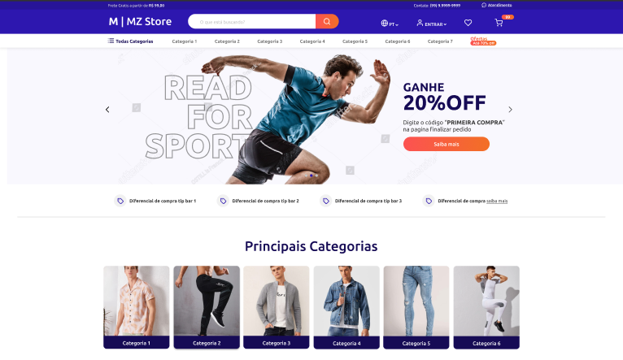

## 💻 Projeto

E-commerce M | MZ Store

## ✨ Tecnologia

- [Vtex](https://vtex.com/br-pt/overview-plataforma/?utm_source=google&utm_medium=cpc&utm_campaign=BR_VTEX_Search_Branded&utm_term=vtex&utm_content=vtex_523171640535)
- [Sass](https://sass-lang.com/)
- [Gulp](https://gulpjs.com/)
- [Babel](https://babeljs.io/)
- [Husky](https://www.npmjs.com/package/husky)
- E muitas outras…

## 🚀 Como executar

Ao acessar a pasta, é preciso baixar os pacotes com o gerenciador de pacotes Yarn.
Você pode executar o seguinte comando:
- yarn install

Em seguida é necessário acessar a plataforma Vtex através do login
- vtex login (aqui o login ao qual tem acesso)

O próximo passo é criar o seu workspace:
- vtex use (nome do workspace em letras mínusculas e sem espaços)

Agora já pode linkar esse tema:
- yarn start

Para acessar a página e todas as suas funcionalidades:
- vtex browse

## 🔖 Layout

Você pode visualizar o layout do projeto através do link abaixo:

- [Layout](https://www.figma.com/file/0F5eJsJ4RQmgLt8OVdSuGv/Desafio-Final---MZ-Next-Level?node-id=697%3A15&t=4VJ9Byl7NfvzBS4e-0)

Lembrando que você precisa ter uma conta no [Figma](http://figma.com/).

  Feito com 💜 por Jessicaandreoli

